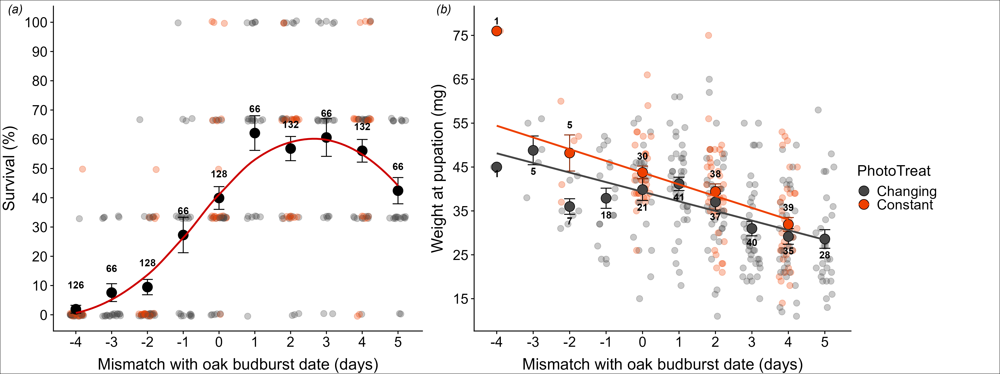

# 1. Introduction

This `.html` file goes along the script `1a_CatFoodExp2021_analysis_fitness.R` needed to reproduce the analysis about the analysis of phenological mismatch (experiment 2021) in the paper _Phenological mismatch affects individual fitness and population growth in the winter moth_, published in Proc Roy Soc B: https://doi.org/10.1098/rspb.2023.0414. This document can be used as a reference for result reproducibility (figures, tables, numbers). Nonetheless, it can be reproduced with the RMarkDown document `analysis_fitness.Rmd`. Note that the `.Rmd` file, as well as the main `.R` script, also contains custom reproducibility check functions that can be used by users to compare produced outputs to reference files.

- Manipulated timing of egg hatching of eggs from wild Mothers caught in 2020
- Either hatching on day of budburst (Day0), before (Day-4 to -1), or after (Day+1 to +5)
- Disentangle effects of photoperiod and food quality: photoperiod treatment (changing or constant)

```{r Initiation, echo = FALSE, results = FALSE, message = FALSE, warning = FALSE}

#----------------------------------  #
# Initiation ####
#----------------------------------- #

# Clear environment
rm(list = ls())

# Restore library
renv::restore()

# If error when downloading digest :
  # (this happens, check https://stackoverflow.com/questions/48548767/can-not-download-digest-package-in-r)
if(!require(digest))
  install.packages('digest', repos = 'http://cran.us.r-project.org')

# We will use this additional package so if not installed:
if(!require(ggpubr)) 
  install.packages('ggpubr') 

# Same for this one:
if(!require(rdryad)) 
  install.packages('rdryad') 

# Setting seed for random processes
set.seed(147)

#----------------------------------  #
# Load packages ####
#----------------------------------- #

library(tidyverse)
library(cowplot)
theme_set(theme_cowplot()) #white background instead of grey -> don't load if want grey grid
library(lme4)
library(lmerTest)
library(Rmisc)
library(rdryad) # To download automatically from Dryad
library(ggpubr) # To arrange multiple figures

#----------------------------------  #
# Load functions ####
#----------------------------------- #

pathF <- c("2_scripts/Functions/") # They are stored here
functions <- list.files(pathF)
sapply(functions, function(file) source(paste0(pathF, file))) %>% invisible

#----------------------------------------------------  #
# Checking file presence for reproducibility checks ####
#----------------------------------------------------- #

  # To verify that reference files for reproducibility checking are present
checkReferenceFilePresence()
  # To verify that outputs were already saved and stored in "_results" folder
checkOutputPresence()

#----------------------------------  #
# User configuration ####
#----------------------------------- #

  # set to TRUE to save figures (as .png files)
save_figures <- FALSE
  # set to TRUE to save tables (as .csv files)
save_tables <- FALSE
  # set to TRUE to save reference outputs (as .rds files)
save_ref_outputs <- FALSE
  # set to TRUE to read reference outputs for comparison
read_ref_outputs <- FALSE
  # set to TRUE to save session info again
save_session_info <- FALSE

  # this creates output directory if saving is enabled
if (save_figures | save_tables && !dir.exists("_results")) {
  dir.create("_results")
}

if (save_ref_outputs && !dir.exists("_results/ref")) {
  dir.create("_results/ref")
}

#----------------------------------  #
# Load data ####
#----------------------------------- #

# Check if data is present in folder
file_name <- "CatFood2021_deposit.csv"
file_path <- file.path("1_data", file_name)
file_exists <- file.exists(file_path)

# If not, automatically download it from Dryad
  # -> that way, this does not require user input
if(file_exists == F) {
  
  # DOI to get data online:
  doi <- "10.5061/dryad.m905qfv5p"
  
  # Download data
  files <- dryad_download(doi)
  
  # Read dataset
  fileTemp <- files[[doi]][grepl(file_name, files[[doi]])]
  d <- read_csv(fileTemp)
  write_csv(d, file_path)
  
}

# Read data
d <- read_csv(file_path)
```

Once all the necessary packages have been loaded, along with the data (which is loaded automatically from Dryad), let's take a quick look at the data. We check that we have the right number of mothers (which should be 22) and the right number of females per area (which should be 3, 6, 6 and 7).

```{r Descriptives, echo = TRUE}

# renaming TubeID as MotherID to match the terminology used in the Statistical section of the paper
d <- dplyr::rename(d, MotherID = TubeID)

# Number of mothers: should be 22
nb_mothers <- length(unique(d$MotherID))
print(nb_mothers)
checkReproducibilityValues(nb_mothers, 22) # checking reproducibility

# Photoperiod and mismatch treatment coded in one variable
table(d$Treatment) 

# N females per Area
fem_per_area <- table(d[!duplicated(d$MotherID), "AreaShortName"])
print(fem_per_area)
checkReproducibilityValues(fem_per_area, c(3, 6, 6, 7)) # checking reproducibility
```

Now we can start with the data analysis. Our first research question is : What are the fitness consequences of day to day timing (a)synchrony with budburst?

# 2. Survival analysis

## 2.1 Survival data

Let us start with the survival analysis. We create the object `d_surv` containing survival values (`Event` column). We check that we have the right number of caterpillars (976). Let us also observe the levels for each variable.

```{r Survival data, echo = TRUE}

d_surv <- d %>% mutate(PhotoTreat=gsub("(\\w+)Day.+","\\1",Treatment), MismTreat=gsub("\\w+(Day.+)","\\1",Treatment)) %>% 
  select(MotherID, Treatment, PhotoTreat, MismTreat, CaterpillarID, DeadAprilDay, PupationAprilDay) %>%
  pivot_longer(cols=c(DeadAprilDay, PupationAprilDay), names_to="Info", values_to="TimeOfEvent") %>%
  filter(!is.na(TimeOfEvent)) %>%
  mutate(Event=ifelse(Info=="DeadAprilDay", 1, 0), Treatment=as.factor(Treatment), PhotoTreat=as.factor(ifelse(PhotoTreat=="Chang", "Changing", "Constant")), 
         MismTreatf=as.factor(MismTreat), MotherID=as.factor(MotherID)) %>%
  mutate(Treatment=factor(Treatment, levels=c("ChangDay-4", "ChangDay-3", "ChangDay-2", "ChangDay-1", "ChangDay0", "ChangDay+1", "ChangDay+2", "ChangDay+3", "ChangDay+4",
                                              "ChangDay+5",  "ConstDay-4", "ConstDay-2", "ConstDay0", "ConstDay+2", "ConstDay+4")), 
    MismTreatf=factor(MismTreat, levels=c("Day-4", "Day-3", "Day-2", "Day-1", "Day0", "Day+1", "Day+2", "Day+3", "Day+4", "Day+5")),
    MismTreat=as.numeric(gsub("Day(.+)","\\1",MismTreat))) %>%
  mutate(MismTreat1=MismTreat+5, # no negatives to be able to fit squared term
         MismTreat2=(MismTreat+5)^2) # squared term to add in model

  # To save d_surv after checking that it is OK (save_tables should be set to TRUE)
if(save_ref_outputs) write_rds(d_surv, "_results/ref/d_surv_expected.rds")
  # To check reproducibility with checked file
checkReproducibilityOutput(d_surv, "_results/ref/d_surv_expected.rds")
  # To read reference file for visual checking
if(read_ref_outputs)
  readReferenceFile("d_surv")

# Vidisha coded it as TimeOfEvent=DeadAprilDay or PupationAprilDay, with event=Died or Survived
head(d_surv)
str(d_surv)
table(d_surv$MismTreat2)

  # Automatic reproducibility check
nb_caterpillars <- length(unique(d_surv$CaterpillarID)) # should be 976
print(nb_caterpillars)
checkReproducibilityValues(nb_caterpillars, 976) 

levels(d_surv$Treatment)
levels(d_surv$PhotoTreat)
levels(d_surv$MismTreatf) # as factor or not? Marcel thinks not
levels(d_surv$MotherID)
table(d_surv$TimeOfEvent)
table(d_surv$Event) # this variable corresponds to "survival" as defined in the paper (e.g., the response variable in the first binomial mixed-effect model)
```

## 2.2 Survival probabilites

Then we can investigate survival probabilities in the table and figures below. `surv_probs` contains survival probability per mother and `surv_avg` the survival averaged over photoperiod treatments. Mother survival plotted according to the photoperiod treatment can be seen in the figure `raw_surv`, displayed below.

```{r Visualize survival probabilities, echo = TRUE}
surv_probs <- aggregate(Event~MismTreat + PhotoTreat + MotherID, d_surv, sum) # per mother
surv_probs$samplesize <- aggregate(Info~MismTreat + PhotoTreat + MotherID, d_surv, length)$Info
surv_probs$probs <- 100 - (surv_probs$Event/surv_probs$samplesize*100) # event = death
head(surv_probs)

surv_avg <- Rmisc::summarySE(surv_probs, measurevar="probs", groupvars=c("MismTreat")) # average of two photoperiod treatments
surv_avg$samplesize <- aggregate(Info~MismTreat, d_surv, length)$Info
surv_avg

  # To save surv_avg after checking that it is OK (save_ref_outputs should be set to TRUE)
if(save_ref_outputs) write_rds(surv_avg, "_results/ref/surv_avg_expected.rds")
  # To check reproducibility with checked file
checkReproducibilityOutput(surv_avg, "_results/ref/surv_avg_expected.rds")
  # To read reference file for visual checking
if(read_ref_outputs) readReferenceFile("surv_avg")

raw_surv <- ggplot(data=surv_avg, aes(x=MismTreat, y=probs))+
  scale_colour_manual(values=c("grey27", "orangered2"))+ #"dodgerblue4"
  geom_jitter(data=surv_probs, aes(col=PhotoTreat), alpha=0.3, size=3, height=0.5, width=0.25)+
  geom_point(size=5, col="black") +
  geom_errorbar(aes(ymax = probs+se, ymin=probs-se), width=0.3, col="black") +
  geom_text(aes(label=samplesize, y=probs+8.3), col="black", size=4,fontface="bold")+ # N caterpillars in each treatment
  labs(y="Survival (%)", x="Mismatch with oak budburst date (days)")+
  scale_y_continuous(breaks=seq(0,100, by=10))+ scale_x_continuous(breaks=seq(-4, 5, by=1))+
  theme(axis.title.y=element_text(size=18, vjust=2), axis.title.x=element_text(size=18, vjust=-0.5),
        axis.text=element_text(size=16), legend.text = element_text(size=16), legend.title=element_text(size=17))
raw_surv 

  # To save the figure
if(save_figures)
  ggsave(filename="_results/Survival_raw.png", plot=raw_surv , device="png", width=200, height=150, units="mm", dpi="print")

  # To save it as the reference file for reproducibility tests
if(save_ref_outputs)
  write_rds(raw_surv, "_results/ref/raw_surv_expected.rds")
  
  # To check correspondence with saved figure (reference)
checkReproducibilityOutput(obtained = raw_surv, 
                           ref_path = "_results/ref/raw_surv_expected.rds", # the expected figure saved as a .RDS
                           ref_vis = "_results/Survival_raw.png", # the expected figure saved as a .PNG
                           print = F)

# To read reference file for visual checking
if(read_ref_outputs) readReferenceFile("raw_surv")
```
## 2.3 Fit binomial models

Now we can fit binomial models to test if the probability of survival differs between treatments. Results from the final model can be seen below.

```{r Fit binomial models, echo = TRUE}
glm1 <- glmer(Event ~ (MismTreat1 + MismTreat2)*PhotoTreat + (1|MotherID), family=binomial, data=d_surv,
              na.action="na.fail", control=glmerControl(calc.derivs=F)) # helps convergence
anova1 <- drop1(glm1,test="Chi") %>% as.data.frame 
  # interaction not significant; the use of Chi-square test to determine statistical significance should be explicitly mention in the paper
anova1$mod <- "glm1"

glm2 <- update(glm1, ~ . -MismTreat1:PhotoTreat - MismTreat2:PhotoTreat) # simplify model
anova2 <- drop1(glm2,test="Chi") %>% as.data.frame #no effect of PhotoTreatment, but effect of MismTreat and MismTreat^2
anova2$mod <- "glm2"

### Final model ####
glm_final <- glm2
summary(glm_final)# Estimates are log odds
glm_res <- summary(glm_final)$coefficients %>% as.data.frame

  # To save model outputs
if(save_tables) {
  write.csv(glm_res, file="_results/output_Surv_glmer.csv", row.names=T)
  write.csv(rbind(anova1, anova2), file="_results/anova_Surv_glmer.csv", row.names=T)
}
  
  # To save them as new references
if(save_ref_outputs) {
  write_rds(glm_res, file = "_results/ref/glm_surv_res_expected.rds")
  write_rds(rbind(anova1, anova2), file = "_results/ref/glm_surv_anova_expected.rds")
}
  
  # To check that model outputs match reference files
checkReproducibilityOutput(glm_res, "_results/ref/glm_surv_res_expected.rds")
checkReproducibilityOutput(rbind(anova1, anova2), "_results/ref/glm_surv_anova_expected.rds")

  # To read reference files for visual comparison
if(read_ref_outputs) {
  readReferenceFile("glm_surv_res")
  readReferenceFile("glm_surv_anova")
}
```

## 2.4 Get survival predictions

Now we can investigate model predictions in `p_surv` figure just below.

```{r Get survival predictions, echo = TRUE}
### Get predictions ####
glm.pred <- d_surv[!duplicated(d_surv[,c("MotherID", "Treatment")]),] # each replicate assigned same prediction, so remove duplicates
glm.pred$pred <- predict(glm_final, newdata=glm.pred, type="response") # predictions are probability of dying now
glm.pred$survprob <- (1-glm.pred$pred)
aggregate(survprob~MismTreat, data=glm.pred, mean) # peak at Day2
glm.pred$rel <- glm.pred$survprob/mean(filter(glm.pred, MismTreat==1)$survprob) # expressive relative to peak
head(glm.pred)

### Visualize predictions ####
pred <- Rmisc::summarySE(glm.pred, measurevar="survprob", groupvars=c("MismTreat")) # average of two photoperiod treatments
pred$samplesize <- aggregate(CaterpillarID~MismTreat, data=d_surv, length)$CaterpillarID

# Add predictions to raw data figure
p_surv <- raw_surv + #geom_line(data=pred, aes(y=survprob*100)) +
  geom_smooth(data=pred, aes(y=survprob*100), se=F, col="red3")
p_surv

  # To save the figure
if(save_figures)
  ggsave(filename="_results/Survival_wpred_rev.png", plot=p_surv, device="png", width=200, height=150, units="mm", dpi="print")

  # To save it as the reference file for reproducibility tests
if(save_ref_outputs)
  write_rds(p_surv, "_results/ref/p_surv_expected.rds")

  # To check correspondence with saved figure (reference)
checkReproducibilityOutput(obtained = p_surv, 
                           ref_path = "_results/ref/p_surv_expected.rds", # the expected figure saved as a .RDS
                           ref_vis = "_resultsSurvival_wpred_rev.png", # the expected figure saved as a .PNG
                           print = F)

# To read the reference file for visual comparison
if(read_ref_outputs) readReferenceFile("p_surv")

rm(anova1, anova2, glm_res, glm1, glm2, pred, surv_probs, surv_avg, raw_surv) #cleanup
```

# 2. Pupation weight analysis

## 2.1 Pupation weight data

Let us pursue with the analysis of pupation weight. We create the object `d_pupa` containing only individuals that survived until pupation. We check that we have the right number of surviving individuals (346), which should make up 35% of the initial number of caterpillars.

```{r Pupation weight data, echo = TRUE}
head(d)

d_pupa <- d %>% mutate(PhotoTreat=gsub("(\\w+)Day.+","\\1",Treatment), MismTreat=gsub("\\w+(Day.+)","\\1",Treatment), PupaWeight=PupaWeight_ingrams*1000) %>%
  select(ExperimentName, MotherID, Treatment, PhotoTreat, MismTreat, CaterpillarID, PupationAprilDay, PupaWeight) %>%
  filter(!is.na(PupationAprilDay)) %>%
  mutate(Treatment=as.factor(Treatment), PhotoTreat=as.factor(ifelse(PhotoTreat=="Chang", "Changing", "Constant")), MismTreatf=as.factor(MismTreat), MotherID=as.factor(MotherID)) %>%
  mutate(Treatment=factor(Treatment, levels=c("ChangDay-4", "ChangDay-3", "ChangDay-2", "ChangDay-1", "ChangDay0", "ChangDay+1", "ChangDay+2", "ChangDay+3", "ChangDay+4",
                                              "ChangDay+5",  "ConstDay-4", "ConstDay-2", "ConstDay0", "ConstDay+2", "ConstDay+4")), 
         MismTreatf=factor(MismTreat, levels=c("Day-4", "Day-3", "Day-2", "Day-1", "Day0", "Day+1", "Day+2", "Day+3", "Day+4", "Day+5")),
         MismTreat=as.numeric(gsub("Day(.+)","\\1",MismTreat))) %>%
  mutate(MismTreat1=MismTreat+5, # no negatives
         MismTreat2=(MismTreat+5)^2) # squared term to add in model

head(d_pupa) 
n_survived <- nrow(d_pupa)
print(n_survived) # 346 individuals survived until pupation
checkReproducibilityValues(n_survived, 346) # automatic reproducibility checking
percent_survived <- n_survived/nrow(d)*100 
print(percent_survived) # ~35%
checkReproducibilityValues(percent_survived, 35.45082) # automatic reproducibility checking
```

## 2.2 Visualize pupation weight data

```{r Visualize pupation weight data, echo = TRUE}
weight <- Rmisc::summarySE(d_pupa, measurevar="PupaWeight", groupvars=c("MismTreat", "PhotoTreat"))
weight$pos <- ifelse(is.na(weight$se)==T, 0, weight$se) # position of sample size labels
weight

  # Saving reference weight file
if(save_ref_outputs) write_rds(weight, "_results/ref/weight_expected.rds")
  # Reproducibility checking
checkReproducibilityOutput(weight, "_results/ref/weight_expected.rds")
  # To read the reference file for visual comparison
if(read_ref_outputs) readReferenceFile("weight")


raw_weight <- ggplot(data=weight, aes(x=MismTreat, y=PupaWeight, col=PhotoTreat, fill=PhotoTreat))+
  scale_colour_manual(values=c("grey27", "orangered2"))+ #"dodgerblue4"
  scale_fill_manual(values=c("grey27", "orangered2"))+
  geom_jitter(data=d_pupa, aes(col=PhotoTreat), alpha=0.3, size=3, height=0, width=0.25)+ #alpha=0.3, size=2, height=0, width=0.25
  geom_errorbar(data=filter(weight, PhotoTreat=="Changing"), aes(ymax = PupaWeight+se, ymin=PupaWeight-se), width=0.3, col="black") +
  geom_errorbar(data=filter(weight, PhotoTreat=="Constant"), aes(ymax = PupaWeight+se, ymin=PupaWeight-se), width=0.3, col="orangered4") +
  geom_point(size=5, shape=21, col="black")+
  #geom_text(data=filter(weight, PhotoTreat=="Changing"),aes(label=N, y=PupaWeight-pos-2.3), col="black", size=4, fontface="bold")+
  #geom_text(data=filter(weight, PhotoTreat=="Constant"),aes(label=N, y=PupaWeight+pos+2.3), col="black", size=4, fontface="bold")+
  labs(y="Weight at pupation (mg)", x="Mismatch with oak budburst date (days)")+
  scale_y_continuous(breaks=seq(15,75, by=10))+ scale_x_continuous(breaks=seq(-4, 5, by=1))+
  theme(axis.title.y=element_text(size=18, vjust=2), axis.title.x=element_text(size=18, vjust=-0.5),
        axis.text=element_text(size=16), legend.text = element_text(size=16), legend.title=element_text(size=17))
raw_weight  

  # To save the figure
if(save_figures)
  ggsave(filename="_results/PupWeight_raw.png", plot=raw_weight , device="png", width=200, height=150, units="mm", dpi="print")
  
  # To save it as the reference file for reproducibility tests
if(save_ref_outputs)
  write_rds(raw_weight, "_results/ref/raw_weight_expected.rds")

  # To check correspondence with saved figure (reference)
checkReproducibilityOutput(obtained = raw_weight, 
                           ref_path = "_results/ref/raw_weight_expected.rds", # the expected figure saved as a .RDS
                           ref_vis = "_results/PupWeight_raw.png", # the expected figure saved as a .PNG
                           print = F)

  # To read the reference file for visual comparison
if(read_ref_outputs) readReferenceFile("raw_weight")


```

## 2.3 Fit linear mixed model

```{r Fit linear mixed model ####, echo = TRUE}
lm1 <- lmer(PupaWeight ~ (MismTreat1 + MismTreat2)*PhotoTreat + (1|MotherID), data=d_pupa)
anova1 <- anova(lm1) %>% as.data.frame() # interaction not significant
anova1$mod <- "lm1"

lm2 <- update(lm1, ~ . - MismTreat1:PhotoTreat - MismTreat2:PhotoTreat) # simplify model
anova2 <- anova(lm2) %>% as.data.frame() # Squared mismatch not significant
anova2$mod <- "lm2"

lm3 <- update(lm2, ~ . - MismTreat2) # simplify model
anova3 <- anova(lm3) %>% as.data.frame() # PhotoTreat and MismTreat significant
anova3$mod <- "lm3"

# Still there if exclude first time point with low sample size?
lm4 <- lmer(PupaWeight ~ -1 + MismTreat1 + PhotoTreat + (1|MotherID), data=filter(d_pupa, MismTreat!=-4))
anova(lm4) # yes


### Final model ####
lm_final <- lm3
summary(lm_final)
lm_res <- summary(lm_final)$coefficients %>% as.data.frame

plot(lm_final) #equal variance? ok
qqnorm(resid(lm_final)) #normally distributed? ok
qqline(resid(lm_final))


# To save model outputs
if(save_tables) {
  write.csv(lm_res, file="_results/output_PupaWeight_lmer.csv", row.names=T)
  write.csv(rbind(anova1, anova2, anova3), file="_results/anova_PupaWeight_lmer.csv", row.names=T)
}

# To save them as new references
if(save_ref_outputs) {
  write_rds(lm_res, file = "_results/ref/lm_weight_res_expected.rds")
  write_rds(rbind(anova1, anova2, anova3), file = "_results/ref/lm_weight_anova_expected.rds")
}

# To check that model outputs match reference files
checkReproducibilityOutput(lm_res, "_results/ref/lm_weight_res_expected.rds")
checkReproducibilityOutput(rbind(anova1, anova2, anova3), "_results/ref/lm_weight_anova_expected.rds")

# To read reference files for visual comparison
if(read_ref_outputs) {
  readReferenceFile("lm_weight_res")
  readReferenceFile("lm_weight_anova")
}

### Get predictions ####
lm.pred <- d_pupa[!duplicated(d_pupa[,c("MotherID", "Treatment")]),] # each replicate assigned same prediction, so remove duplicates
lm.pred$pred <- predict(lm_final, newdata=lm.pred, type="response")
head(lm.pred)
```

## 2.4 Visualize weight predictions

```{r Visualize weight predictions, echo = TRUE}
pred1 <- Rmisc::summarySE(lm.pred, measurevar="pred", groupvars=c("MismTreat", "PhotoTreat")) # significant effect of photoperiod, so show separate means
pred1$samplesize <- weight$N
pred1$pos <- ifelse(is.na(pred1$se)==T, 0, pred1$se) # position of sample size labels

## add predictions to raw data figure
p_weight <- raw_weight + #geom_line(data=pred1, aes(y=pred)) +
  geom_smooth(data=pred1, aes(y=pred, col=PhotoTreat), se=F, method=lm)+
  geom_text(data=filter(weight, PhotoTreat=="Changing"),aes(label=N, y=PupaWeight-pos-1.5), col="black", size=4, fontface="bold")+
  geom_text(data=filter(weight, PhotoTreat=="Constant"),aes(label=N, y=PupaWeight+pos+2.3), col="black", size=4, fontface="bold")
p_weight

# To save the figure
if(save_figures)
  ggsave(filename="_results/PupWeight_wpred_rev.png", plot=p_weight, device="png", width=200, height=150, units="mm", dpi="print")
  
# To save it as the reference file for reproducibility tests
if(save_ref_outputs)
  write_rds(p_weight, "_results/ref/p_weight_expected.rds")

# To check correspondence with saved figure (reference)
checkReproducibilityOutput(obtained = p_weight, 
                           ref_path = "_results/ref/p_weight_expected.rds", # the expected figure saved as a .RDS
                           ref_vis = "_results/PupWeight_wpred_rev.png", # the expected figure saved as a .PNG
                           print = F)

# To read the reference file for visual comparison
if(read_ref_outputs) readReferenceFile("p_weight")
```

# 3. Making figure 2

Now we can make figure 2 that contains both survival and weight data and predictions.

```{r Making figure 2, echo = TRUE, out.width = "100%"}
# Making figure 2 entirely code-based
# common_legend in ggarrange() does not work properly here
  # (to get legend on the right)
# so we use a trick by combining ggpubr and cowplot
# we extract the legend, which is considered as a different figure
# then we arrange figure position with cowplot::plot_grid()
fig2_layout <- 
  ggpubr::ggarrange(p_surv + theme(legend.position = "none"),
                    p_weight + theme(legend.position = "none"), 
                    nrow = 1,
                    labels = c("(a)", "(b)"),
                    font.label = list(face = "italic")) 

fig2 <- 
  cowplot::plot_grid(fig2_layout, 
                     # extracting legend here
                     ggpubr::get_legend(p_weight), 
                     # to arrange positions
                     rel_widths = c(0.6, 0.1)) +
  bgcolor('white')


  # sate save_figures to TRUE to save the figure again
if(save_figures) 
  ggplot2::ggsave(filename = "_results/figure_2.png",
                  fig2, 
                  device = "png", 
                  width = 400, 
                  height = 150, 
                  units = "mm", 
                  dpi = "print")

  # sate save_ref_outputs to TRUE to save it as a reference file
  # for reproducibility checking
if(save_ref_outputs)
  write_rds(fig2, file = "_results/ref/fig2_expected.rds")

# Checking reproducibility
  # !! CheckReproducibilityOuput() function does not work for complex figures generated with ggpubr/cowplot
  # Please visually refer to the reference figure for checking that it matches the output
message('fig2 should match the file saved as _results/ref/fig_2_expected.rds')
message('Set read_ref_outputs to TRUE and run the following line to plot the reference file:')
if(read_ref_outputs)
  readReferenceFile("fig2")
```


<!-- Figure 2 needs to be stored locally in order to be loaded here -->

# 4. Get fitness curve

## 4.1 Fit GLM

Now we can estimate the relative fitness curve for phenological mismatch, combining the predicted survival probabilities and the predicted pupation weights (as a proxy for fecundity) for each phenological mismatch treatment. Let us start with fitting the corresponding models.

```{r Fit GLM, echo = TRUE}
# Don't care about PhotoTreat effect, drop from models
glm_fit <- glmer(Event ~ MismTreat1 + MismTreat2 + (1 | MotherID), family="binomial", data=d_surv)
lm_fit <- lmer(PupaWeight ~ MismTreat1 + (1 | MotherID), data=d_pupa)

### Get predictions to use for curve ####
glm.fit <- d_surv[!duplicated(d_surv[,c("MotherID", "MismTreatf")]),] # each replicate assigned same prediction, so remove duplicates
glm.fit$pred <- predict(glm_fit, newdata=glm.fit, type="response") # predictions are probability of dying now
glm.fit$survpred <- (1-glm.fit$pred)

lm.fit <- d_pupa[!duplicated(d_pupa[,c("MotherID", "MismTreatf")]),] # each replicate assigned same prediction, so remove duplicates
lm.fit$pred <- predict(lm_fit, newdata=lm.fit, type="response")

head(glm.fit) # pred = probability of dying, survpred=1-pred, 220 observations = 22 mothers * 10 MismTreat groups
head(lm.fit) # pred=predicted weight from lmer, only 154 observations
```


## 4.2 Fit curve to absolute fitness

We then estimate fitness by multiplying predictions of survival probabilities with expected pupation weights in `RelFit`table (`Fit` and `Fit2`columns, see comments below).

```{r Fit curve, echo = TRUE}
RelFit <- merge(glm.fit[,c("MotherID", "MismTreat", "survpred")], lm.fit[,c("MotherID", "MismTreat", "pred")], by=c("MotherID", "MismTreat"), all=T)
colnames(RelFit)[c(3,4)] <- c("survpred", "pupwpred")
RelFit$Fit <- RelFit$survpred*RelFit$pupwpred # multiply absolute values
head(RelFit) # can only do for 154 observations, clutches with >=1 caterpillar surviving until pupation
table(RelFit$MismTreat, is.na(RelFit$Fit)) # for the other clutches, fitness = 0
RelFit$Fit2 <- ifelse(is.na(RelFit$Fit)==T, 0, RelFit$Fit)
```

## 4.3 LOESS model to describe the curve

We then express fitness at each day of mismatch with oak budburst date relatively to the fitness peak (which occurs at day 2) in the `rel` column of `relFit` object and average over treatments in `RelFit_means`. We also  use a LOESS model to fit a curve to the data (see `curve` just below).

```{r loess model, echo = TRUE}
loess_mod <- loess(Fit2~ -1 + MismTreat,  data=RelFit) 
summary(loess_mod)

curve <- RelFit[!duplicated(RelFit[,c("MismTreat")]),] %>% select(MismTreat)
curve$pred <- predict(loess_mod, newdata=curve)
curve <- arrange(curve, MismTreat)
curve # peak at day2
curve$rel <- curve$pred/filter(curve, MismTreat==2)$pred # expressive relative to peak

RelFit$rel <- RelFit$Fit2/mean(filter(RelFit, MismTreat==2)$Fit2)

RelFit_means <- Rmisc::summarySE(RelFit, measurevar="rel", groupvars=c("MismTreat"))
#RelFit_means$samplesize <- aggregate(MotherID~MismTreat, data=d_pupa, length)$MotherID # number of caterpillars curve is based on
RelFit_means$samplesize <- aggregate(MotherID~MismTreat, data=d_surv, length)$MotherID # number of caterpillars curve is based on = all
RelFit_means$curve <- curve$rel
head(RelFit_means)

  # To save RelFit_means
if(save_tables) write.csv(RelFit_means, file="_results/RelFitness_rev.csv", row.names=F)
  # To save it as a new reference
if(save_ref_outputs) write_rds(RelFit_means, file = "_results/ref/RelFit_means_expected.rds")
  # To check that the table matches the reference file
checkReproducibilityOutput(RelFit_means, "_results/ref/RelFit_means_expected.rds")
  # To read the reference file for visual comparison
if(read_ref_outputs) readReferenceFile("RelFit_means")
```

## 4.4 Visualize predictions

Finally, we visualize fitness predictions in the `p_relfit` curve below.

```{r fitness predictions, echo = TRUE}
### Visualize predictions ####
p_relfit <- ggplot(data=RelFit, aes(x=MismTreat, y=rel)) +
  geom_jitter(size=3, alpha=0.4, height=0, width=0.25, shape=21, fill="dodgerblue2", col="dodgerblue4")+
  geom_point(data=RelFit_means, size=5) +
  geom_errorbar(data=RelFit_means, aes(ymax = rel+se, ymin=rel-se), width=0.3) +
  #geom_line(data=curve, aes(y=pred), col="darkred", size=1)+
  #geom_smooth(data=curve, se=F, col="red3", size=1)+ # makes it look more like a smooth line, but otherwise exactly the same as using geom_line
  geom_text(data=RelFit_means,aes(label=samplesize, y=rel+0.12), col="black", size=5, fontface="bold")+ # number of caterpillars
  geom_hline(yintercept=1, linetype="dashed")+
  labs(y="Relative fitness", x="Mismatch with oak budburst date (days)")+
  scale_y_continuous(lim=c(0,1.21), breaks=seq(0,1.6, by=0.2))+ scale_x_continuous(breaks=seq(-4,5, by=1))+ #lim=c(-0.1,1.3)
  theme(legend.position="none")+
  theme(axis.title.y=element_text(size=18, vjust=2), axis.title.x=element_text(size=18, vjust=-0.5),
        axis.text=element_text(size=16), legend.text = element_text(size=16), legend.title=element_text(size=17))
p_relfit

# To save the figure
if(save_figures)
  ggsave(filename="_results/FitnessCurve_rev.png", plot=p_relfit, device="png", width=200, height=150, units="mm", dpi="print")
  
# To save it as the reference file for reproducibility tests
if(save_ref_outputs)
  write_rds(p_relfit, "_results/ref/p_relfit_expected.rds")

# To check correspondence with saved figure (reference)
checkReproducibilityOutput(obtained = p_relfit, 
                           ref_path = "_results/ref/p_relfit_expected.rds", # the expected figure saved as a .RDS
                           ref_vis = "_results/FitnessCurve_rev.png", # the expected figure saved as a .PNG
                           print = F)

# To read the reference file for visual comparison
if(read_ref_outputs) readReferenceFile("p_relfit")
```

## 4.5 Average fitness loss per day

Finally, we can calculate the average daily fitness loss for individuals that hatched either before or after the 'peak' day (`fitness_loss_hatchedEarlier` or `fitness_loss_hatchedLater`, respectively).

```{r daily fitness loss, echo = TRUE}
  # 1. Hatching earlier than budburst date
fitness_loss_hatchedEarlier <- 
RelFit_means %>%
  dplyr::select(MismTreat, curve) %>%
  dplyr::filter(MismTreat <= 2) %>%
  dplyr::rename("pred_fitness" = "curve") %>%
  # What would have been the mean fitness if hatched one day later?
  mutate(lagged_fitness = lead(pred_fitness)) %>%
  mutate(fitness_loss = lagged_fitness - pred_fitness)

fitness_loss_hatchedEarlier %>% print
  # Mean value ? Should be 14%
fitness_loss_earlier <- na.omit(fitness_loss_hatchedEarlier$fitness_loss)
mean_fitness_loss_earlier <- exp(mean(log(fitness_loss_earlier))) %>% round(2)
checkReproducibilityValues(mean_fitness_loss_earlier, 0.14)
  # Max value ? Should be 32%
fitness_loss_hatchedEarlier %>% dplyr::slice(which.max(fitness_loss)) # corresponds to day -1
max_fitness_loss_earlier <- fitness_loss_hatchedEarlier$fitness_loss %>% max(na.rm = T) %>% round(2)
checkReproducibilityValues(max_fitness_loss_earlier, 0.32)

  # 2. Hatching later than budburst date
fitness_loss_hatchedLater <- 
RelFit_means %>%
  dplyr::select(MismTreat, curve) %>%
  dplyr::filter(MismTreat >= 2) %>%
  dplyr::rename("pred_fitness" = "curve") %>%
  # What would have been the mean fitness if hatched one day later?
  mutate(lagged_fitness = lag(pred_fitness)) %>%
  mutate(fitness_loss = lagged_fitness - pred_fitness)

fitness_loss_hatchedLater %>% print
  # Mean value ? Should be 13% (although reported as 6% in paper)
fitness_loss_Later <- na.omit(fitness_loss_hatchedLater$fitness_loss)
mean_fitness_loss_Later <- exp(mean(log(fitness_loss_Later))) %>% round(2)
checkReproducibilityValues(mean_fitness_loss_Later, 0.13)
  # Max value ? Should be 32%
fitness_loss_hatchedLater %>% dplyr::slice(which.max(fitness_loss)) # corresponds to day -1
max_fitness_loss_Later <- fitness_loss_hatchedLater$fitness_loss %>% max(na.rm = T) %>% round(2)
checkReproducibilityValues(max_fitness_loss_Later, 0.24)

  # To save output tables
if(save_tables) {
  write.csv(fitness_loss_hatchedEarlier, file="_results/fitness_loss_hatchedEarlier.csv")
  write.csv(fitness_loss_hatchedLater, file="_results/fitness_loss_hatchedEarlier.csv")
}
  # To save them as new references
if(save_ref_outputs) {
  write_rds(fitness_loss_hatchedEarlier, file = "_results/ref/fitness_loss_hatchedEarlier_expected.rds")
  write_rds(fitness_loss_hatchedLater, file = "_results/ref/fitness_loss_hatchedLater_expected.rds")
}
  # To check that tables match the reference files
checkReproducibilityOutput(fitness_loss_hatchedEarlier, "_results/ref/fitness_loss_hatchedEarlier_expected.rds")
checkReproducibilityOutput(fitness_loss_hatchedLater, "_results/ref/fitness_loss_hatchedLater_expected.rds")

  # To read reference files for visual comparison
if(read_ref_outputs) {
  readReferenceFile("fitness_loss_hatchedEarlier")
  readReferenceFile("fitness_loss_hatchedLater")
}
```

```{r session info, echo = FALSE, message = FALSE, results = FALSE}
#--------------------------------------------  #
## Session info ####
#--------------------------------------------  #

if(save_session_info) 
  sessionInfo() %>% 
  capture.output(file="_src/env_CatFoodExp2021_analysis.txt")

```

